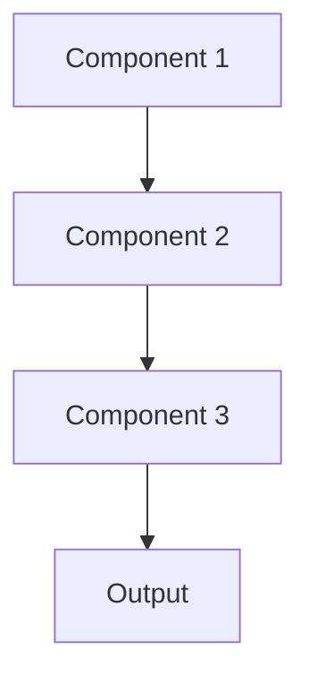

# Project Prompt Plan

## Project: [PROJECT_NAME]
## Complexity Level: [SIMPLE|MEDIUM|COMPLEX|BEAST]
## Estimated Steps: [NUMBER]

### Project Overview
[Describe the project goal in 2-3 sentences]

### Success Criteria
- [ ] [Measurable outcome 1]
- [ ] [Measurable outcome 2]
- [ ] [Measurable outcome 3]

### Technical Requirements
- Language: [LANGUAGE]
- Framework: [FRAMEWORK]
- Key Libraries: [LIBRARIES]
- Performance Targets: [METRICS]

### Architecture Decisions


## Implementation Plan

### Phase 1: Foundation ⏱️ [TIME_ESTIMATE]
- [ ] **Step 1.1**: Set up project structure
  - Create directory layout
  - Initialize package manager
  - Set up git repository
  - Status: `⏳ Pending`

- [ ] **Step 1.2**: Configure development environment
  - Install dependencies
  - Set up linting/formatting
  - Configure build tools
  - Status: `⏳ Pending`

- [ ] **Step 1.3**: Create test framework
  - Set up test runner
  - Create test structure
  - Write initial smoke tests
  - Status: `⏳ Pending`

### Phase 2: Core Implementation ⏱️ [TIME_ESTIMATE]
- [ ] **Step 2.1**: [FEATURE_NAME]
  ```
  Description: [What this does]
  Acceptance Criteria:
  - [Criteria 1]
  - [Criteria 2]
  Tests Required:
  - [Test 1]
  - [Test 2]
  ```
  - Status: `⏳ Pending`

- [ ] **Step 2.2**: [FEATURE_NAME]
  - Status: `⏳ Pending`

### Phase 3: Enhancement ⏱️ [TIME_ESTIMATE]
- [ ] **Step 3.1**: Performance optimization
  - Profile current performance
  - Identify bottlenecks
  - Implement optimizations
  - Verify improvements
  - Status: `⏳ Pending`

- [ ] **Step 3.2**: Error handling and logging
  - Add comprehensive error handling
  - Implement structured logging
  - Add monitoring hooks
  - Status: `⏳ Pending`

### Phase 4: Polish & Deploy ⏱️ [TIME_ESTIMATE]
- [ ] **Step 4.1**: Documentation
  - API documentation
  - User guide
  - Developer guide
  - Status: `⏳ Pending`

- [ ] **Step 4.2**: Deployment preparation
  - Create deployment scripts
  - Set up CI/CD
  - Create Docker image (if applicable)
  - Status: `⏳ Pending`

## Complexity Handlers

### If Complexity Increases:
1. Break current step into sub-steps
2. Add more comprehensive tests
3. Create intermediate milestones
4. Request architecture review

### Auto-Update Rules:
- Mark steps `✅ Complete` when done
- Update time estimates based on actual
- Add discovered steps as needed
- Track blockers and solutions

## Execution Command
```bash
# Use this to execute the plan
claude "Open @prompt_plan.md and work on the next pending step. Update status when complete."
```

## Metrics Tracking
- Total Steps: [NUMBER]
- Completed: [NUMBER]
- Success Rate: [PERCENTAGE]
- Average Time per Step: [TIME]

---
*This plan auto-updates based on project progress and complexity changes.*
