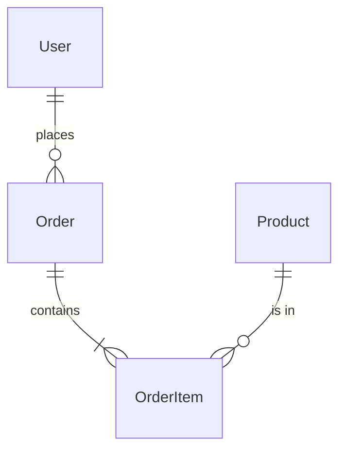

# Specification Generator for Claude Code

## 🎯 Purpose

Transform vague requirements into detailed specifications that Claude Code can execute flawlessly. This generator uses reasoning models to create comprehensive specs.

## 📝 Spec Generation Template

```markdown
# Project Specification: [PROJECT_NAME]

## Executive Summary
[2-3 sentences describing the project goal and value]

## Stakeholders
- **End Users**: [Who will use this]
- **Technical Team**: [Who will maintain this]
- **Business Owner**: [Who requested this]

## Functional Requirements

### Core Features
1. **[Feature Name]**
   - Description: [What it does]
   - User Story: As a [user type], I want [goal] so that [benefit]
   - Acceptance Criteria:
     - [ ] [Specific measurable criterion]
     - [ ] [Specific measurable criterion]
   - Priority: [High/Medium/Low]

### User Workflows
1. **[Workflow Name]**
   ```
   Start -> [Step 1] -> [Step 2] -> [Decision?] -> [Step 3] -> End
   ```
   - Happy Path: [Description]
   - Alternative Paths: [Description]
   - Error Scenarios: [Description]

## Technical Requirements

### Architecture
- **Pattern**: [MVC/Microservices/Serverless/etc]
- **Database**: [SQL/NoSQL/Graph/etc]
- **API Design**: [REST/GraphQL/gRPC/etc]
- **Authentication**: [JWT/OAuth/Session/etc]

### Performance Targets
- Response Time: < [X]ms for 95th percentile
- Throughput: [X] requests/second
- Concurrent Users: [X]
- Data Volume: [X] GB

### Security Requirements
- [ ] Input validation on all endpoints
- [ ] Authentication required for [resources]
- [ ] Rate limiting: [X] requests per [time]
- [ ] Encryption: [at rest/in transit]
- [ ] Audit logging for [actions]

## Data Model

### Entities
```yaml
User:
  - id: UUID
  - email: string (unique)
  - password: string (hashed)
  - created_at: timestamp
  - updated_at: timestamp

[Entity Name]:
  - field: type (constraints)
```

### Relationships


## API Specification

### Endpoints
```yaml
GET /api/v1/[resource]
  Description: [What it does]
  Auth: [Required/Optional]
  Query Params:
    - limit: number (default: 20, max: 100)
    - offset: number (default: 0)
  Response:
    200:
      - data: array
      - meta: object
    404:
      - error: string

POST /api/v1/[resource]
  Description: [What it does]
  Auth: Required
  Body:
    - field: type (required)
  Response:
    201:
      - data: object
    400:
      - errors: array
```

## Implementation Plan

### Phase 1: Foundation (Week 1)
- [ ] Project setup and configuration
- [ ] Database schema implementation
- [ ] Basic authentication system
- [ ] Core data models

### Phase 2: Core Features (Week 2-3)
- [ ] [Feature 1] implementation
- [ ] [Feature 2] implementation
- [ ] API endpoint development
- [ ] Unit test coverage > 80%

### Phase 3: Polish (Week 4)
- [ ] Performance optimization
- [ ] Security hardening
- [ ] Documentation
- [ ] Deployment setup

## Success Metrics
- [ ] All functional requirements met
- [ ] Performance targets achieved
- [ ] Security scan passed
- [ ] Test coverage > 80%
- [ ] Documentation complete

## Risks & Mitigation
| Risk | Probability | Impact | Mitigation |
|------|------------|--------|------------|
| [Risk 1] | High/Med/Low | High/Med/Low | [Strategy] |

## Dependencies
- External APIs: [List any]
- Libraries: [Critical ones]
- Services: [Required services]

## Glossary
- **[Term]**: [Definition]
- **[Acronym]**: [Expansion and explanation]
```

## 🤖 Claude Code Spec Generation Prompts

### From User Story to Spec
```bash
claude "Convert this user story into a detailed specification:
[PASTE USER STORY]

Include:
1. Functional requirements with acceptance criteria
2. Technical architecture recommendations
3. Data model with relationships
4. API endpoints needed
5. Implementation phases
6. Success metrics

Use the specification template format."
```

### From Idea to Spec
```bash
claude "I want to build [DESCRIBE IDEA]. 

Create a comprehensive specification that includes:
- Problem statement and solution approach
- User personas and workflows
- Technical architecture
- Implementation roadmap
- Risk analysis

Make reasonable assumptions and note them."
```

### From Existing Code to Spec
```bash
claude "Analyze [FILE/DIRECTORY] and reverse-engineer a specification that documents:
- Current functionality
- Architecture patterns used
- Data models
- API contracts
- Missing features or improvements

Format as a proper specification document."
```

## 🔄 Spec Refinement Process

### 1. Initial Generation
```bash
claude "Generate initial spec for [PROJECT] based on:
Requirements: [BASIC REQUIREMENTS]
Constraints: [CONSTRAINTS]
Similar to: [REFERENCE PROJECTS]"
```

### 2. Stakeholder Review
```bash
claude "Review this spec from the perspective of:
1. End user - identify missing features
2. Developer - identify technical challenges
3. Business owner - identify ROI concerns

Suggest improvements for each perspective."
```

### 3. Technical Validation
```bash
claude "Validate this spec for:
- Technical feasibility
- Performance achievability
- Security completeness
- Scalability concerns

Flag any issues and suggest solutions."
```

## 📊 Complexity-Driven Spec Detail

### Simple Project (< 1 week)
- 2-3 page specification
- Basic requirements
- Simple data model
- 5-10 API endpoints

### Medium Project (1-4 weeks)
- 5-10 page specification
- Detailed workflows
- Complete data model
- 15-30 API endpoints
- Performance targets

### Complex Project (> 1 month)
- 15+ page specification
- Multiple user personas
- Microservices architecture
- 50+ API endpoints
- Detailed risk analysis

## 🎯 Spec Quality Checklist

- [ ] **Complete**: All requirements addressed
- [ ] **Unambiguous**: No room for interpretation
- [ ] **Testable**: Clear success criteria
- [ ] **Feasible**: Technically achievable
- [ ] **Traceable**: Requirements linked to features
- [ ] **Prioritized**: Clear importance levels

## 🚀 Advanced Spec Patterns

### 1. Living Specifications
```bash
# Update spec as code evolves
claude "Compare @spec.md with current implementation in @src/
Update the spec to reflect:
- Implemented features
- Changed requirements
- Discovered edge cases
Mark changes with [UPDATED: date]"
```

### 2. Spec-Driven Development
```bash
# Generate code from spec
claude "Using @spec.md, generate:
1. Database migrations
2. API endpoint stubs
3. Test cases for each requirement
4. Basic implementation structure"
```

### 3. Multi-Version Specs
```bash
# Maintain versions
claude "Create spec v2.0 based on v1.0 with these changes:
[LIST CHANGES]
Include migration guide from v1 to v2"
```

## 📈 Spec Effectiveness Metrics

Track these to improve spec quality:
1. **Clarification Requests**: Lower is better
2. **Change Requests**: During development
3. **Bug Root Cause**: Spec vs implementation
4. **Time to First PR**: Faster with good specs
5. **Rework Percentage**: Should decrease

## 🔧 Integration with Claude Code Workflow

```bash
#!/bin/bash
# Spec-driven development workflow

# 1. Generate spec
claude "Generate spec for: $1" > spec.md

# 2. Review and refine
claude "Review and improve @spec.md" > spec_v2.md

# 3. Generate implementation plan
claude "Create @prompt_plan.md from @spec_v2.md"

# 4. Start implementation
claude "Implement first phase of @prompt_plan.md"
```

Remember: A good specification is worth 10x the time spent creating it in saved development time.
