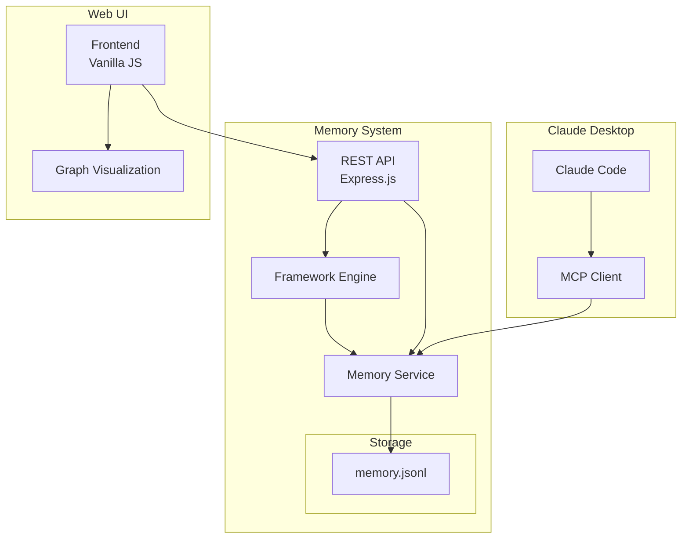

# Superkraftmat Memory System - Architecture Overview

## 🏗️ System Architecture



## 📋 Component Overview

### 1. **MCP Integration Layer**
- **Purpose**: Bridge between Claude Desktop and Memory System
- **Technology**: Model Context Protocol
- **Location**: `mcp-server/`
- **Key Files**: 
  - `mcp-server/index.js` - MCP server implementation
  - `claude_desktop_config.json` - Claude configuration

### 2. **API Layer**
- **Purpose**: RESTful interface for all memory operations
- **Technology**: Express.js
- **Location**: `backend/src/`
- **Key Endpoints**:
  - `/api/entities` - CRUD operations for entities
  - `/api/relations` - Manage relationships
  - `/api/search` - Search functionality
  - `/api/framework/*` - Framework operations

### 3. **Framework Engine**
- **Purpose**: Intelligent context retrieval and optimization
- **Technology**: Node.js modules
- **Location**: `backend/src/framework/`
- **Components**:
  - `engine.js` - Core retrieval logic
  - `analyzer.js` - Pattern detection
  - `optimizer.js` - Token usage optimization

### 4. **Memory Service**
- **Purpose**: Core knowledge graph operations
- **Technology**: File-based JSONL storage
- **Location**: `backend/src/services/`
- **Features**:
  - Atomic operations
  - Validation
  - Indexing
  - Backup/restore

### 5. **Web UI**
- **Purpose**: Visual interface for memory management
- **Technology**: Vanilla JavaScript, CSS3
- **Location**: `frontend/src/`
- **Features**:
  - Entity/relation visualization
  - CRUD operations
  - Search and filter
  - Framework controls

## 🔄 Data Flow

### 1. **Claude Code → Memory**
```
Claude Code Query
    ↓
MCP Protocol
    ↓
Memory Service
    ↓
JSONL File
```

### 2. **UI → Memory**
```
User Action
    ↓
Frontend API Call
    ↓
Express Router
    ↓
Controller
    ↓
Service Layer
    ↓
JSONL File
```

### 3. **Framework Flow**
```
Query Input
    ↓
Pattern Analysis
    ↓
Tier Determination
    ↓
Entity Collection
    ↓
Relation Traversal
    ↓
Context Assembly
    ↓
Token Optimization
    ↓
Response
```

## 💾 Data Model

### Entity Structure
```typescript
interface Entity {
  name: string;           // Unique identifier
  entityType: string;     // Category (Person, Project, etc.)
  observations: string[]; // Facts about the entity
}
```

### Relation Structure
```typescript
interface Relation {
  from: string;        // Source entity name
  to: string;          // Target entity name
  relationType: string; // Type of relationship
}
```

### Memory File Format (JSONL)
```json
{"type":"entity","name":"Example","entityType":"demo","observations":["fact1","fact2"]}
{"type":"relation","from":"Example","to":"Another","relationType":"uses"}
```

## 🎯 Design Principles

### 1. **Simplicity First**
- No external database dependencies
- Human-readable storage format
- Minimal configuration

### 2. **Performance Conscious**
- Lazy loading where possible
- Efficient search algorithms
- Optimized for < 10MB files

### 3. **Extensibility**
- Plugin architecture for future features
- Clear interfaces between components
- Version-controlled storage format

### 4. **Developer Experience**
- Clear error messages
- Comprehensive logging
- Self-documenting code

## 🔐 Security Architecture

### Data Security
- Local file storage only
- No external data transmission
- User-controlled access

### API Security
- CORS configuration
- Input validation
- Rate limiting (planned)

### Future Considerations
- Authentication system
- Role-based access
- Audit logging

## 📈 Scalability Strategy

### Current Limits
- Optimized for < 10,000 entities
- Single-user focus
- Local storage only

### Growth Path
1. **Phase 1**: File-based sharding
2. **Phase 2**: SQLite integration
3. **Phase 3**: PostgreSQL + Redis
4. **Phase 4**: Distributed system

## 🔧 Technology Decisions

### Why Vanilla JavaScript?
- No framework lock-in
- Maximum flexibility
- Easier for contributors
- Smaller bundle size

### Why JSONL?
- Line-based processing
- Git-friendly diffs
- Streaming support
- Human readable

### Why Express.js?
- Mature ecosystem
- Simple routing
- Extensive middleware
- Well documented

## 🚀 Future Architecture

### Planned Enhancements
1. **WebSocket Support**: Real-time updates
2. **Worker Threads**: Background processing
3. **GraphQL API**: Alternative to REST
4. **Plugin System**: Extensible architecture

### Microservices Evolution
```
Current: Monolithic
    ↓
Next: Modular monolith
    ↓
Future: Microservices
    - Memory Service
    - Search Service
    - Analytics Service
    - Auth Service
```

## 📚 Related Documents

- [API Documentation](../api/README.md)
- [Deployment Guide](../deployment/README.md)
- [Performance Tuning](./performance.md)
- [Security Considerations](./security.md)

---

*For architecture decisions and rationale, see the [decisions/](decisions/) directory*
